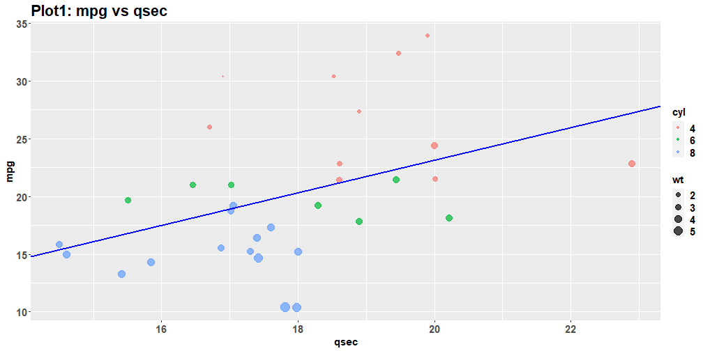

## Project Description

- Application plots in plot1 variables chosen from dataset mtcars and clusters points by color and size for two 
additional covariates. Linear model 1 (Prediction ~ Regressor1) plotted in Plot1 on chosen data points.
- Plot2 shows relations Prediction and Regressor1, Regressor2; clusters points by color (Point Color variable) 
and plots linear model 2 (Prediction ~ Regressor1 + Regressor2)

# Output:
- 2d plot (library ggplot2) described above
- 3d plot (library rgl) described above
- On the Sidebar Panel:
	. Slope - slope of the linear model1
	. Intercept - intercept of the linear model1

--- .class #id 

## Application Interface 


[Application](https://norbik91.shinyapps.io/shiny-project/)

--- .class 1

## R code of 2d plot example


```r
library(ggplot2)
model <- lm(mpg ~ qsec, data = mtcars)
mtcars$cyl <- factor(mtcars$cyl)
g <- ggplot(data = mtcars, aes(x = qsec, y = mpg,
                                        color = cyl, size = wt)) +
      geom_point(shape=19, alpha = 0.7) +
      labs(title = "Plot1: mpg vs qsec") +
      theme(plot.title = element_text(size = rel(2), face = "bold"),
            legend.title = element_text(size=15, face="bold"),
            legend.text = element_text(size=15, face="bold"),
            axis.title.x = element_text(size=15, face="bold"),
            axis.title.y = element_text(size=15, face="bold"),
            axis.text.x = element_text(size=15, face="bold"),
            axis.text.y = element_text(size=15, face="bold"),) +
      geom_abline(intercept = model[[1]][1], slope = model[[1]][2], color="blue", size=1)
```

--- .class 1

## 2d Plot example


